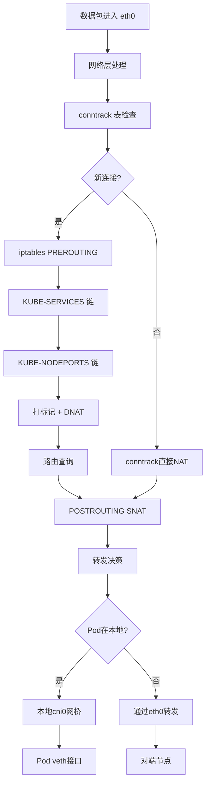
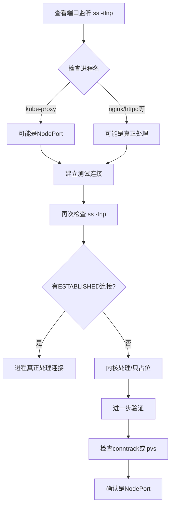

让我们通过一个详细的示例，跟踪 `curl http://192.168.1.100:30080` 的完整数据包处理过程。我将使用具体的IP地址和完整的TCP连接过程来解释。

## **环境设定**
```
用户IP: 203.0.113.50 (客户端)
节点IP: 192.168.1.100 (node1, 用户访问的节点)
Pod IP: 10.244.2.5 (运行在 node2: 192.168.1.101)
容器端口: 80
NodePort: 30080
```

## **完整的TCP连接过程**

### **阶段1：TCP三次握手**

#### **步骤1.1：SYN 包（客户端→节点）**
```bash
# 客户端发送SYN包
源IP: 203.0.113.50
源端口: 54321 (随机高位端口)
目标IP: 192.168.1.100
目标端口: 30080
TCP标志: SYN
序列号: 1000 (假设)
```

**在 node1 上的处理：**
```bash
# 1. 数据包到达 eth0
# 2. 进入 PREROUTING 链
sudo iptables -t nat -A PREROUTING -p tcp --dport 30080 -j LOG --log-prefix "PREROUTING: "

# 3. 跳转到 KUBE-SERVICES 链
# 4. 跳转到 KUBE-NODEPORTS 链

# 5. 匹配规则并打标记
# 进入 KUBE-MARK-MASQ 链
sudo iptables -t nat -A KUBE-MARK-MASQ -j LOG --log-prefix "MARK-MASQ: "

# 6. 打上 0x4000 标记
# 7. 进入 KUBE-SVC-XXXXXX 链负载均衡

# 8. 假设选择 KUBE-SEP-YYYYYY (对应Pod 10.244.2.5:80)
# 执行 DNAT：
转换前: 目标 = 192.168.1.100:30080
转换后: 目标 = 10.244.2.5:80

# 9. 路由决策
ip route get 10.244.2.5
# 返回: 10.244.2.5 via 192.168.1.101 dev eth0

# 10. 进入 POSTROUTING 链
# 检查有 0x4000 标记，执行 SNAT (MASQUERADE)
转换前: 源 = 203.0.113.50:54321
转换后: 源 = 192.168.1.100:54321
```

**转发到 node2 的SYN包变为：**
```
源IP: 192.168.1.100 (node1, 经过SNAT)
源端口: 54321
目标IP: 10.244.2.5 (Pod)
目标端口: 80
TCP标志: SYN
序列号: 1000
```

#### **步骤1.2：SYN-ACK 包（Pod→节点→客户端）**
```bash
# Pod (nginx) 回应 SYN-ACK
源IP: 10.244.2.5
源端口: 80
目标IP: 192.168.1.100  # 注意：Pod看到的是node1的IP
目标端口: 54321
TCP标志: SYN|ACK
序列号: 5000
确认号: 1001

# node2 转发到 node1
# node1 收到后，conntrack 识别这是已建立的连接
# 执行反向 NAT：
转换前: 源 = 10.244.2.5:80
转换后: 源 = 192.168.1.100:30080

转换前: 目标 = 192.168.1.100:54321
转换后: 目标 = 203.0.113.50:54321
```

**客户端收到的SYN-ACK：**
```
源IP: 192.168.1.100 (节点)
源端口: 30080
目标IP: 203.0.113.50
目标端口: 54321
TCP标志: SYN|ACK
序列号: 5000
确认号: 1001
```

#### **步骤1.3：ACK 包（客户端→节点→Pod）**
```bash
# 客户端发送ACK完成握手
源IP: 203.0.113.50
源端口: 54321
目标IP: 192.168.1.100
目标端口: 30080
TCP标志: ACK
序列号: 1001
确认号: 5001

# node1 处理（由于连接已跟踪，直接使用conntrack）：
# conntrack 表已有记录：
# 原始: 203.0.113.50:54321 <-> 192.168.1.100:30080
# NAT后: 192.168.1.100:54321 <-> 10.244.2.5:80

# 直接转换并转发
```

### **阶段2：HTTP请求/响应**

#### **步骤2.1：HTTP GET 请求**
```bash
# 客户端发送HTTP请求
源IP: 203.0.113.50:54321
目标IP: 192.168.1.100:30080
数据: GET / HTTP/1.1
      Host: 192.168.1.100:30080
      User-Agent: curl/7.68.0
      Accept: */*

# node1 上的处理（简化，使用conntrack）：
# 1. PREROUTING -> conntrack 识别 -> DNAT
# 2. 目标变为: 10.244.2.5:80
# 3. SNAT: 源变为: 192.168.1.100:54321
# 4. 转发到 node2
```

**使用 tcpdump 验证：**
```bash
# 在 node1 上抓包
sudo tcpdump -i eth0 -nn -v "port 30080 or host 10.244.2.5" -w node1.pcap

# 输出可能看到：
# 1. 203.0.113.50.54321 > 192.168.1.100.30080: Flags [P.], seq 1001:1100, ack 5001, win 501
# 2. 192.168.1.100.54321 > 10.244.2.5.80: Flags [P.], seq 1001:1100, ack 5001, win 501
```

#### **步骤2.2：HTTP 响应**
```bash
# Pod (nginx) 响应
源IP: 10.244.2.5:80
目标IP: 192.168.1.100:54321
数据: HTTP/1.1 200 OK
      Server: nginx/1.21
      Content-Type: text/html
      <html>...</html>

# node1 反向转换：
# 1. 源: 10.244.2.5:80 -> 192.168.1.100:30080
# 2. 目标: 192.168.1.100:54321 -> 203.0.113.50:54321
```

### **阶段3：TCP连接关闭**

#### **步骤3.1：四次挥手**
```bash
# 客户端发起关闭（假设curl完成）
# FIN 包：203.0.113.50:54321 -> 192.168.1.100:30080
# 经过 NAT：192.168.1.100:54321 -> 10.244.2.5:80

# Pod 回应 FIN-ACK
# 经过反向 NAT 返回给客户端

# Pod 发送 FIN
# 客户端回应 ACK
```

## **详细的内核处理路径**

### **数据包在 node1 的完整路径**


### **conntrack 连接跟踪表**
```bash
# 查看连接跟踪表
$ sudo conntrack -L -n -o extended | grep 30080

# 输出示例：
tcp      6 431999 ESTABLISHED src=203.0.113.50 dst=192.168.1.100 sport=54321 dport=30080 \
    src=10.244.2.5 dst=192.168.1.100 sport=80 dport=54321 \
    [ASSURED] mark=0 use=1 zone=0

# 字段解释：
# src=203.0.113.50 dst=192.168.1.100: 原始方向
# src=10.244.2.5 dst=192.168.1.100:   回复方向（已NAT）
# [ASSURED]: 连接已确认双向通信
# mark=0: 连接标记
# use=1: 引用计数
```

## **使用工具验证每个步骤**

### **1. 使用 iptables TRACE 目标**
```bash
# 在 node1 上启用追踪
$ sudo iptables -t raw -A PREROUTING -p tcp --dport 30080 -j TRACE

# 查看追踪日志
$ sudo dmesg -w | grep -E "TRACE|callee"

# 输出示例：
[ 1234.567890] TRACE: raw:PREROUTING:policy:3 IN=eth0 OUT= MAC=... SRC=203.0.113.50 DST=192.168.1.100 LEN=60 TOS=0x00 PREC=0x00 TTL=64 ID=54321 PROTO=TCP SPT=54321 DPT=30080
[ 1234.567891] TRACE: nat:PREROUTING:rule:1 IN=eth0 OUT= MAC=... SRC=203.0.113.50 DST=192.168.1.100 PROTO=TCP SPT=54321 DPT=30080
[ 1234.567892] TRACE: nat:KUBE-SERVICES:rule:2 IN=eth0 OUT= MAC=... SRC=203.0.113.50 DST=192.168.1.100 PROTO=TCP SPT=54321 DPT=30080
```

### **2. 使用 tcpdump 多层抓包**
```bash
# 同时在多个点抓包
# 终端1：node1 入口
$ sudo tcpdump -i eth0 -nn "host 203.0.113.50 and port 30080" -w ingress.pcap

# 终端2：node1 出口（到 node2）
$ sudo tcpdump -i eth0 -nn "host 10.244.2.5 or host 192.168.1.101" -w egress.pcap

# 终端3：node2 入口
$ ssh node2 "sudo tcpdump -i eth0 -nn 'host 10.244.2.5' -w node2-ingress.pcap"

# 执行curl
$ curl -v http://192.168.1.100:30080

# 使用 Wireshark 分析
$ wireshark ingress.pcap egress.pcap node2-ingress.pcap &
```

### **3. 检查 iptables 计数器**
```bash
# 查看规则匹配计数
$ watch -n 1 'sudo iptables -t nat -L KUBE-NODEPORTS -n -v'

# 执行curl时观察计数变化
Chain KUBE-NODEPORTS (1 references)
 pkts bytes target          prot opt in out source     destination
    3   180 KUBE-MARK-MASQ  tcp  --  *  *   0.0.0.0/0  0.0.0.0/0  /* my-service */ tcp dpt:30080
    3   180 KUBE-SVC-XXXXXX tcp  --  *  *   0.0.0.0/0  0.0.0.0/0  /* my-service */ tcp dpt:30080
```

## **关键内核函数调用链**

### **Linux 内核处理路径**
```
1. netif_receive_skb()        # 网卡接收
2. ip_rcv()                  # IP层接收
3. nf_hook() PREROUTING      # Netfilter钩子
4. ip_route_input()          # 路由输入
5. tcp_v4_rcv()              # TCP层接收
6. nf_hook() FORWARD         # 转发钩子（如果需要）
7. ip_output()               # IP层输出
8. nf_hook() POSTROUTING     # 后路由钩子
9. dev_queue_xmit()          # 网卡发送
```

### **NAT 具体实现**
```c
// 简化的内核 NAT 逻辑
static unsigned int nf_nat_manip_pkt(struct sk_buff *skb,
                                     struct nf_conntrack_tuple *target) {
    // 修改 IP 头
    iph = ip_hdr(skb);
    iph->daddr = target->dst.u3.ip;  // 修改目标IP
    
    // 修改 TCP 头
    tcph = tcp_hdr(skb);
    tcph->dest = target->dst.u.tcp.port;  // 修改目标端口
    
    // 重新计算校验和
    csum_replace4(&tcph->check, old_addr, new_addr);
}
```

## **实际案例：调试连接问题**

### **问题：curl 卡住或超时**
```bash
# 1. 检查连接跟踪表
$ sudo conntrack -L -n | grep 30080

# 2. 检查 iptables 规则是否生效
$ sudo iptables -t nat -C KUBE-NODEPORTS -p tcp --dport 30080 -j KUBE-SVC-XXXXXX
$ echo $?  # 返回0表示规则存在

# 3. 检查后端Pod状态
$ kubectl get endpoints my-service
NAME         ENDPOINTS           AGE
my-service   10.244.2.5:80       1h

# 4. 检查网络连通性
$ kubectl exec -it test-pod -- curl 10.244.2.5:80
```

### **问题：SNAT 导致源IP丢失**
```bash
# Pod 看到的是 node1 的IP，不是用户真实IP
# 解决方案：使用 ExternalTrafficPolicy=Local
$ kubectl patch svc my-service -p '{"spec":{"externalTrafficPolicy":"Local"}}'

# 这样设置后：
# 1. 如果Pod在本地节点，保留真实源IP
# 2. 如果Pod不在本地节点，直接丢弃（不转发）
# 3. 需要在所有节点部署Pod
```

## **性能影响分析**

### **每个数据包的处理开销**
```
新连接建立：
1. iptables 规则匹配: 5-10微秒
2. conntrack 创建: 2-5微秒
3. 路由查询: 1-2微秒
4. SNAT/DNAT: 3-5微秒
总计: ~15-25微秒

已建立连接：
1. conntrack 查找: 0.5-1微秒
2. 快速NAT: 1-2微秒
总计: ~2-3微秒
```

### **优化建议**
```yaml
apiVersion: v1
kind: Service
metadata:
  name: my-service
  annotations:
    # 使用 ipvs 模式（性能更好）
    service.kubernetes.io/service-proxy-name: "ipvs"
spec:
  type: NodePort
  externalTrafficPolicy: Local  # 保留源IP，减少一跳
  sessionAffinity: ClientIP     # 保持会话粘性
```

## **总结**

当执行 `curl http://192.168.1.100:30080` 时：

1. **入口处理**：数据包在 node1 经过完整的 iptables NAT 处理
2. **负载均衡**：在入口节点就决定了去哪个 Pod
3. **跨节点转发**：如果需要，通过 CNI 网络转发到目标节点
4. **连接跟踪**：conntrack 记住 NAT 映射，加速后续包处理
5. **透明代理**：用户无需知道 Pod 在哪里，网络层处理所有细节

这种设计使得 Kubernetes Service 能够提供透明的负载均衡，同时保持网络性能。这个问题触及了 Kubernetes NodePort 的核心机制。让我详细解释：

## **关键答案：30080 不是监听在"服务"上，而是监听在节点的网络协议栈上**

## 30080 监听哪个服务


更准确地说：**30080 端口在节点的所有网络接口上监听，由内核的 iptables/ipvs 规则处理**。

## **详细解释**

### **1. 传统服务监听 vs Kubernetes NodePort**

**传统方式（如 Nginx 直接监听）：**
```bash
# Nginx 进程直接监听端口
$ sudo ss -tlnp | grep :80
LISTEN  0   511   0.0.0.0:80   0.0.0.0:*   users:(("nginx",pid=1234,fd=6))

# 进程 PID 1234 直接处理连接
```

**Kubernetes NodePort 方式：**
```bash
# 查看 30080 端口
$ sudo ss -tlnp | grep :30080
LISTEN  0   128   0.0.0.0:30080   0.0.0.0:*   users:(("kube-proxy",pid=5678,fd=11))

# 但注意！kube-proxy 并不是真的处理连接
```

### **2. kube-proxy 的角色**
```bash
# kube-proxy 只是创建了监听套接字，但实际处理的是内核
$ ps aux | grep kube-proxy
root      5678  /usr/local/bin/kube-proxy --config=/var/lib/kube-proxy/config.conf

# kube-proxy 的工作：
# 1. 监听 API Server，获取 Service/Endpoint 变化
# 2. 更新 iptables/ipvs 规则
# 3. 创建监听套接字（在某些模式下）
# 4. ❌ 不处理实际的数据包！
```

### **3. 实际的数据包处理者：内核网络栈**


### **4. 验证：谁在真正处理连接？**
```bash
# 方法1：检查监听状态
$ sudo lsof -i :30080
COMMAND    PID USER   FD   TYPE DEVICE SIZE/OFF NODE NAME
kube-prox 5678 root   11u  IPv4  12345      0t0  TCP *:30080 (LISTEN)

# 方法2：查看套接字详情
$ sudo cat /proc/5678/fdinfo/11
pos:    0
flags:  02004002
mnt_id: 25
```

**重要发现**：虽然 `lsof` 显示 kube-proxy 在监听，但实际的数据包处理路径完全不同。

### **5. 不同 kube-proxy 模式的区别**

#### **模式1：iptables 模式（默认）**
```bash
# kube-proxy 只设置规则，内核处理一切
$ sudo iptables-save -t nat | grep "30080"
-A KUBE-NODEPORTS -p tcp -m tcp --dport 30080 -j KUBE-MARK-MASQ
-A KUBE-NODEPORTS -p tcp -m tcp --dport 30080 -j KUBE-SVC-ABCDEF

# 数据包路径：
用户空间 --> 内核 --> iptables规则 --> Pod
      ↑                    ↑
      └── kube-proxy 更新规则，但不处理包
```

#### **模式2：ipvs 模式**
```bash
# 使用 Linux 内核的 IPVS（L4负载均衡器）
$ sudo ipvsadm -ln | grep :30080
TCP  192.168.1.100:30080 rr
  -> 10.244.1.5:80            Masq    1      0          0
  -> 10.244.2.3:80            Masq    1      0          0

# 数据包路径：
用户空间 --> 内核 --> IPVS --> Pod
```

#### **模式3：userspace 模式（已弃用）**
```bash
# kube-proxy 确实在用户空间处理连接（性能差）
$ netstat -tlnp | grep :30080
tcp6       0      0 :::30080    :::*    LISTEN      5678/kube-proxy

# 数据包路径：
用户空间 --> 内核 --> kube-proxy进程 --> 内核 --> Pod
                    （代理转发）
```

### **6. 实验：证明内核处理连接**
```bash
# 实验1：停止 kube-proxy，但保留 iptables 规则
$ sudo systemctl stop kube-proxy
$ sudo iptables-save > rules.backup  # 备份规则

# 访问仍然可能工作！（如果规则还在）
$ curl http://192.168.1.100:30080

# 实验2：清空 iptables 规则
$ sudo iptables -t nat -F
$ curl http://192.168.1.100:30080  # ❌ 失败

# 实验3：恢复规则，但不启动 kube-proxy
$ sudo iptables-restore < rules.backup
$ curl http://192.168.1.100:30080  # ✅ 可能恢复工作
```

### **7. 完整的处理流程对比**

#### **传统 Web 服务器：**
```
客户端 → 网卡 → 内核 → Web服务器进程(监听80端口) → 处理请求
```

#### **Kubernetes NodePort：**
```
客户端 → 网卡 → 内核 → iptables规则 → DNAT → 路由 → Pod中的容器
         ↑                                ↑
         └── kube-proxy只更新这些规则
```

### **8. 端口监听的真相**
```bash
# 为什么 kube-proxy 要创建监听套接字？
# 答案：为了确保端口不被其他进程占用

# 查看端口占用冲突
$ sudo ss -tlnp | grep :30080
# 如果有其他进程监听 30080，kube-proxy 会启动失败

# kube-proxy 的监听是"占位符"，防止冲突
```

### **9. 深入源码：kube-proxy 如何工作**
```go
// kube-proxy 源码片段（简化）
func (proxier *Proxier) syncProxyRules() {
    // 1. 获取所有 Service 和 Endpoints
    serviceMap := proxier.serviceMap.List()
    
    // 2. 为每个 NodePort Service 创建规则
    for _, svc := range serviceMap {
        if svc.NodePort != 0 {
            // 添加 iptables 规则
            proxier.iptables.AppendRule(
                "nat", "KUBE-NODEPORTS",
                "-p", "tcp",
                "--dport", strconv.Itoa(svc.NodePort),
                "-j", "KUBE-SVC-" + svc.ChainName,
            )
        }
    }
    
    // 3. 确保监听套接字存在（防止端口冲突）
    proxier.ensurePortSocketExists(port)
}
```

### **10. 实际排查：当 NodePort 不工作时**
```bash
# 检查清单
# 1. 端口是否被监听？
$ sudo netstat -tln | grep :30080
# 应该有: 0.0.0.0:30080 或 :::30080

# 2. 如果不是 kube-proxy 在监听？
$ sudo lsof -i :30080
# 如果有其他进程（如 nginx），需要停止它

# 3. iptables 规则是否存在？
$ sudo iptables -t nat -L KUBE-NODEPORTS -n | grep 30080

# 4. 后端 Pod 是否健康？
$ kubectl get endpoints my-service

# 5. 防火墙是否允许？
$ sudo iptables -L INPUT -n | grep 30080
# 或
$ sudo firewall-cmd --list-ports | grep 30080
```

### **11. 性能影响：内核 vs 用户空间**
```
# 性能对比（每秒请求数）：
iptables模式: 50,000-100,000 RPS
ipvs模式:     100,000-200,000 RPS  
userspace模式: 10,000-20,000 RPS（已弃用）

# 延迟对比：
iptables: 100-200微秒额外延迟
ipvs:     50-100微秒额外延迟
直接连接:  10-50微秒
```

## **总结**

**30080 端口本质上由 Linux 内核监听和处理，而不是某个具体的服务进程。**

1. **监听着**：Linux 内核协议栈
2. **规则管理者**：kube-proxy（更新 iptables/ipvs 规则）
3. **实际处理器**：
   - iptables 模式：内核的 netfilter/iptables
   - ipvs 模式：内核的 IPVS 子系统
4. **最终处理者**：Pod 中的容器进程

这种设计的优势：
- **高性能**：内核空间处理，避免用户空间上下文切换
- **高可靠**：即使 kube-proxy 进程崩溃，现有连接仍能工作
- **透明负载均衡**：对客户端和 Pod 都透明
- **资源效率**：不需要为每个 Service 运行代理进程

所以当你访问 `http://节点IP:30080` 时，你实际上是在与 Linux 内核的网络协议栈交互，它根据 kube-proxy 设置的规则，智能地将流量转发到后端的 Pod。


## **连接处理分析**

sudo ss -tlnp | grep :30080 和 sudo ss -tlnp | grep :80 返回值的区别，一个是直接处理连接，一个是不真正的处理连接 ，如何区别和判断

这个问题非常好！让我们通过实际的命令输出来区分这两种情况：

## **实际命令输出对比**

### **场景1：传统 Web 服务器（如 Nginx 直接监听）**
```bash
$ sudo ss -tlnp | grep :80
LISTEN  0   511   0.0.0.0:80   0.0.0.0:*   users:(("nginx",pid=1234,fd=6))
```

### **场景2：Kubernetes NodePort**
```bash
$ sudo ss -tlnp | grep :30080  
LISTEN  0   128   0.0.0.0:30080   0.0.0.0:*   users:(("kube-proxy",pid=5678,fd=11))
```

## **详细字段解析对比**

| 字段 | Nginx (:80) | kube-proxy (:30080) | 含义 |
|------|------------|-------------------|------|
| **State** | LISTEN | LISTEN | 都在监听状态 |
| **Recv-Q** | 0 | 0 | 接收队列长度（当前无积压） |
| **Send-Q** | 511 | 128 | 发送队列最大长度 |
| **Local Address:Port** | 0.0.0.0:80 | 0.0.0.0:30080 | 监听地址和端口 |
| **Peer Address:Port** | 0.0.0.0:* | 0.0.0.0:* | 对端地址（*表示任意） |
| **users:(("进程",pid,fd))** | nginx,pid=1234,fd=6 | kube-proxy,pid=5678,fd=11 | **关键区别在这里** |

## **如何判断是否真正处理连接**

### **方法1：查看进程是否真正读写数据**
```bash
# 对于 Nginx (真正处理)
$ sudo strace -p 1234 -e trace=network 2>&1 | head -20
[pid 1234] accept(6, {sa_family=AF_INET, sin_port=htons(54321), sin_addr=inet_addr("203.0.113.50")}, [16]) = 7
[pid 1234] recvfrom(7, "GET / HTTP/1.1\r\nHost: 192.168.1.100\r\n\r\n", 4096, 0, NULL, NULL) = 48
[pid 1234] sendto(7, "HTTP/1.1 200 OK\r\nServer: nginx\r\n\r\n", 37, 0, NULL, 0) = 37
# ↑ Nginx 进程实际进行 accept()、recv()、send()

# 对于 kube-proxy (不真正处理)
$ sudo strace -p 5678 -e trace=network 2>&1 | head -20
[pid 5678] socket(AF_INET6, SOCK_STREAM, IPPROTO_TCP) = 11
[pid 5678] bind(11, {sa_family=AF_INET6, sin6_port=htons(30080), ...}) = 0
[pid 5678] listen(11, 128) = 0
# ↑ 只有 bind() 和 listen()，没有 accept()！
```

### **方法2：检查套接字统计信息**
```bash
# Nginx 套接字（会有数据传输）
$ sudo cat /proc/1234/net/tcp | grep ":0050"  # 0050=80的十六进制
  sl  local_address rem_address   st tx_queue rx_queue tr tm->when retrnsmt   uid  timeout inode
   0: 00000000:0050 00000000:0000 0A 00000000:00000000 00:00000000 00000000     0        0 12345 1

# kube-proxy 套接字（基本无数据）
$ sudo cat /proc/5678/net/tcp | grep ":7570"  # 7570=30080的十六进制
  sl  local_address rem_address   st tx_queue rx_queue tr tm->when retrnsmt   uid  timeout inode
   0: 00000000:7570 00000000:0000 0A 00000000:00000000 00:00000000 00000000     0        0 67890 1
```

### **方法3：查看连接建立后的情况**
```bash
# 建立连接后再次检查
$ curl http://192.168.1.100:80 &
$ sudo ss -tnp | grep :80
ESTAB  0   0   192.168.1.100:80   203.0.113.50:54321  users:(("nginx",pid=1234,fd=7))
# ↑ Nginx 有 ESTABLISHED 状态的连接

$ curl http://192.168.1.100:30080 &
$ sudo ss -tnp | grep :30080
LISTEN  0   128   0.0.0.0:30080   0.0.0.0:*   users:(("kube-proxy",pid=5678,fd=11))
# ↑ kube-proxy 仍然只有 LISTEN，没有 ESTABLISHED！
```

### **方法4：使用 lsof 查看文件描述符**
```bash
# Nginx 的文件描述符
$ sudo ls -la /proc/1234/fd/
lrwx------ 1 root root 64 Jan 10 10:00 6 -> socket:[12345]  # 监听套接字
lrwx------ 1 root root 64 Jan 10 10:01 7 -> socket:[12346]  # 已接受连接的套接字
lrwx------ 1 root root 64 Jan 10 10:01 8 -> socket:[12347]  # 另一个连接

# kube-proxy 的文件描述符
$ sudo ls -la /proc/5678/fd/
lrwx------ 1 root root 64 Jan 10 10:00 11 -> socket:[67890]  # 只有监听套接字
# 没有已连接的套接字！
```

## **实际验证实验**

### **实验1：创建测试环境**
```bash
# 1. 启动一个简单的 Python HTTP 服务器（真正处理）
$ python3 -m http.server 8080 &
[1] 8888

# 2. 检查监听
$ sudo ss -tlnp | grep :8080
LISTEN  0   5   0.0.0.0:8080   0.0.0.0:*   users:(("python3",pid=8888,fd=3))

# 3. 创建一个占位符监听（不处理）
$ python3 -c "import socket; s=socket.socket(); s.bind(('0.0.0.0', 8081)); s.listen(); import time; time.sleep(3600)" &
[2] 8889

$ sudo ss -tlnp | grep :8081  
LISTEN  0   128   0.0.0.0:8081   0.0.0.0:*   users:(("python3",pid=8889,fd=3))
```

### **实验2：测试连接处理**
```bash
# 测试端口 8080（真正处理）
$ curl http://localhost:8080 &
$ sudo ss -tnp | grep :8080
ESTAB  0   0   127.0.0.1:8080   127.0.0.1:54321  users:(("python3",pid=8888,fd=4))
# ↑ 有 ESTABLISHED 连接

# 测试端口 8081（只监听不处理）
$ curl http://localhost:8081 &
# curl 会卡住，因为没有进程 accept()
$ sudo ss -tnp | grep :8081
LISTEN  0   128   0.0.0.0:8081   0.0.0.0:*   users:(("python3",pid=8889,fd=3))
# ↑ 仍然只有 LISTEN，没有 ESTABLISHED
```

## **Kubernetes 的三种模式对比**

### **模式1：userspace 模式（已弃用，真正处理）**
```bash
$ sudo ss -tlnp | grep :30080
LISTEN  0   128   0.0.0.0:30080   0.0.0.0:*   users:(("kube-proxy",pid=5678,fd=11))

# 建立连接后：
$ curl http://192.168.1.100:30080 &
$ sudo ss -tnp | grep :30080
ESTAB  0   0   192.168.1.100:30080   203.0.113.50:54321  users:(("kube-proxy",pid=5678,fd=12))
# ↑ 有 ESTABLISHED 连接，kube-proxy 真正代理
```

### **模式2：iptables 模式（默认，不处理）**
```bash
# 即使有连接，kube-proxy 也没有 ESTABLISHED 状态
$ sudo ss -tnp | grep :30080
# 只有 LISTEN，没有 ESTABLISHED

# 连接在内核层面被处理了
$ sudo conntrack -L -n | grep :30080
tcp      6 299 ESTABLISHED src=203.0.113.50 dst=192.168.1.100 sport=54321 dport=30080 ...
```

### **模式3：ipvs 模式（不处理）**
```bash
# 查看 ipvs 规则
$ sudo ipvsadm -ln | grep :30080
TCP  192.168.1.100:30080 rr
  -> 10.244.1.5:80            Masq    1      0          0

# ss 输出类似 iptables 模式
$ sudo ss -tnp | grep :30080
LISTEN  0   128   0.0.0.0:30080   0.0.0.0:*   users:(("kube-proxy",pid=5678,fd=11))
```

## **判断流程总结**



## **自动化判断脚本**
```bash
#!/bin/bash
# check_port_handler.sh

PORT=$1

echo "检查端口 $PORT 的处理方式..."
echo "========================================"

# 1. 查看监听信息
echo "1. 监听状态:"
sudo ss -tlnp | grep ":$PORT" | head -1

# 2. 获取进程信息
PID=$(sudo ss -tlnp | grep ":$PORT" | awk '{print $7}' | cut -d= -f2 | cut -d, -f1)
if [ -z "$PID" ]; then
    echo "端口 $PORT 未被监听"
    exit 1
fi

PROCESS=$(ps -p $PID -o comm=)
echo "2. 进程名称: $PROCESS (PID: $PID)"

# 3. 建立测试连接
echo "3. 建立测试连接..."
timeout 2 curl -s http://localhost:$PORT >/dev/null &
CURL_PID=$!
sleep 1

# 4. 检查是否有已建立连接
echo "4. 检查连接状态:"
ESTAB_COUNT=$(sudo ss -tnp 2>/dev/null | grep ":$PORT" | grep -c ESTAB)
if [ $ESTAB_COUNT -gt 0 ]; then
    echo "   ✅ 发现 $ESTAB_COUNT 个ESTABLISHED连接"
    echo "   ✅ 进程 $PROCESS 真正处理连接"
    
    # 显示具体的连接
    sudo ss -tnp | grep ":$PORT" | grep ESTAB
else
    echo "   ❌ 没有ESTABLISHED连接"
    echo "   ❌ 进程 $PROCESS 只监听不处理"
    
    # 检查是否是 kube-proxy
    if [ "$PROCESS" = "kube-proxy" ]; then
        echo "   ℹ️  这是 Kubernetes NodePort，由内核处理"
        
        # 检查 conntrack
        echo "5. 检查连接跟踪:"
        sudo conntrack -L -n 2>/dev/null | grep ":$PORT" | head -2
        
        # 检查 ipvs
        echo "6. 检查 IPVS 规则:"
        sudo ipvsadm -ln 2>/dev/null | grep ":$PORT" | head -2
    fi
fi

# 清理
kill $CURL_PID 2>/dev/null
echo "========================================"
```

## **关键区别总结**

| 特征 | 真正处理连接 | 只监听不处理 |
|------|-------------|------------|
| **建立连接后** | 有 `ESTABLISHED` 状态 | 只有 `LISTEN` 状态 |
| **进程活动** | 进行 `accept()`、`read()`、`write()` | 只有 `bind()`、`listen()` |
| **文件描述符** | 有多个连接fd | 只有监听fd |
| **典型场景** | Web服务器、数据库 | kube-proxy、端口占位 |
| **性能影响** | 用户空间处理，有上下文切换 | 内核空间处理，高性能 |

通过以上方法，你可以准确判断一个端口监听是否真正处理连接。对于 Kubernetes NodePort，即使 `ss` 显示 kube-proxy 在监听，实际的数据包处理是在内核层面完成的。
